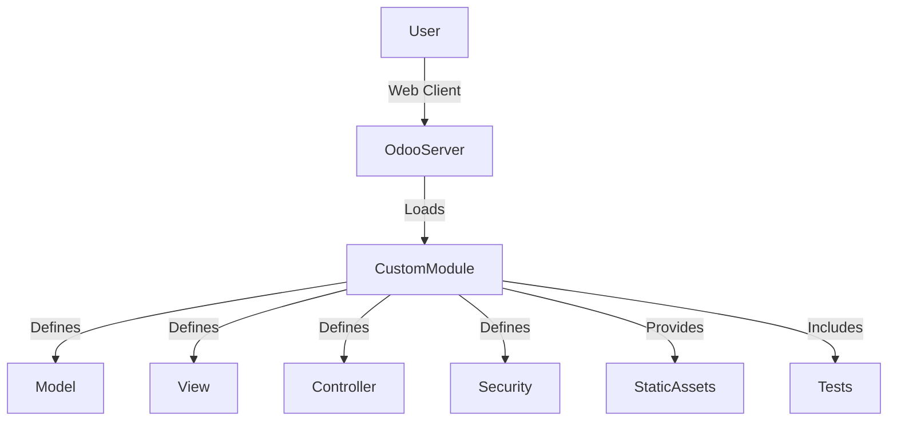

# Component View (Odoo)

## Main Components
- **Odoo Server**: Core platform running all modules.
- **Custom Modules**: Extend Odoo functionality (e.g., library management, HR, sales).
- **Models**: Define business data and logic (Python classes).
- **Views**: Define UI (forms, lists, kanban, dashboards) using XML/QWeb.
- **Controllers**: Handle HTTP requests for custom endpoints.
- **Security**: Access rights, record rules, user groups.
- **Static Assets**: JS, CSS, images, OWL components for advanced UI.
- **Tests**: Automated tests for models, controllers, and business logic.

## Example Interaction Diagram

