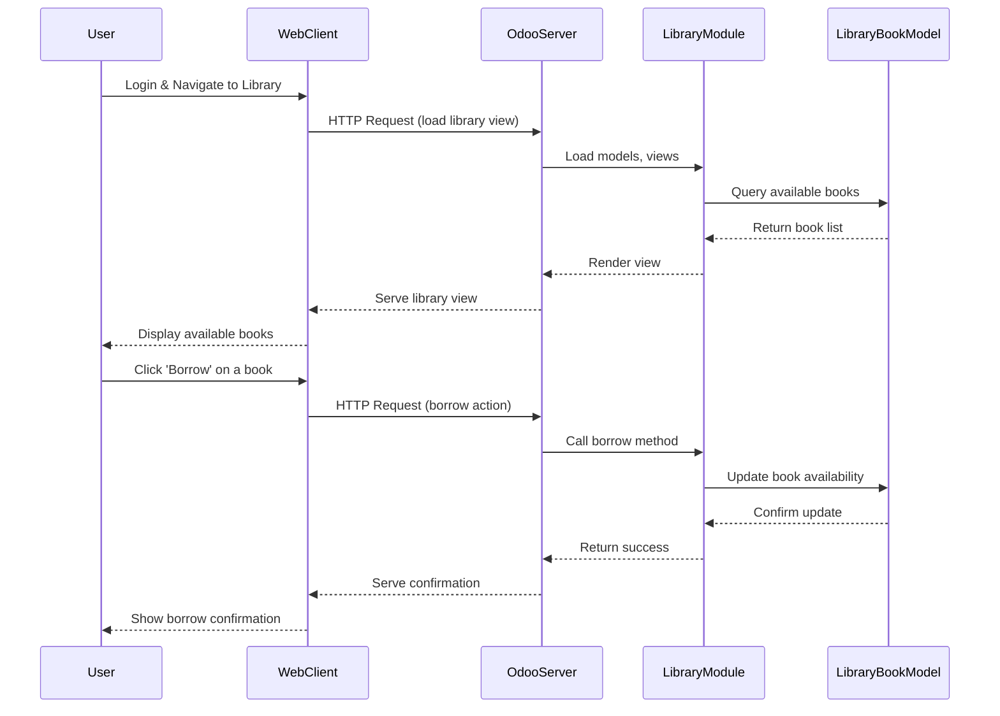

# Sequence Diagrams (Odoo)

## Example: Book Borrowing Workflow

```mermaid
sequenceDiagram
    participant User
    participant WebClient
    participant OdooServer
    participant LibraryModule
    participant LibraryBookModel

    User->>WebClient: Login & Navigate to Library
    WebClient->>OdooServer: HTTP Request (load library view)
    OdooServer->>LibraryModule: Load models, views
    LibraryModule->>LibraryBookModel: Query available books
    LibraryBookModel-->>LibraryModule: Return book list
    LibraryModule-->>OdooServer: Render view
    OdooServer-->>WebClient: Serve library view
    WebClient-->>User: Display available books
    User->>WebClient: Click 'Borrow' on a book
    WebClient->>OdooServer: HTTP Request (borrow action)
    OdooServer->>LibraryModule: Call borrow method
    LibraryModule->>LibraryBookModel: Update book availability
    LibraryBookModel-->>LibraryModule: Confirm update
    LibraryModule-->>OdooServer: Return success
    OdooServer-->>WebClient: Serve confirmation
    WebClient-->>User: Show borrow confirmation
``` 